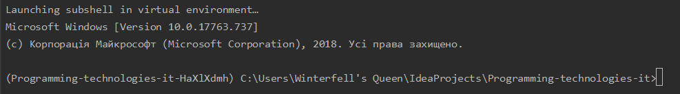
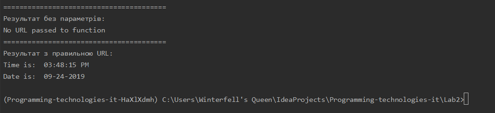
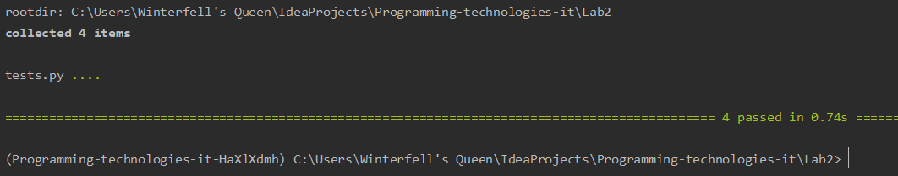
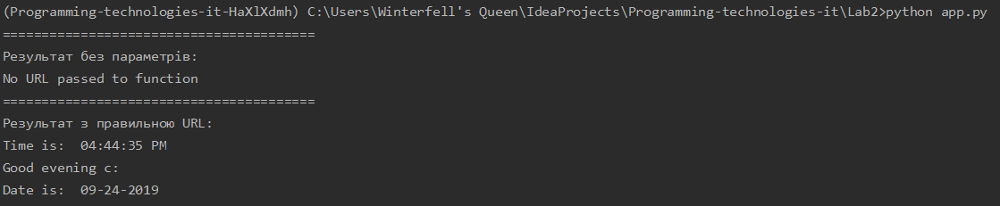
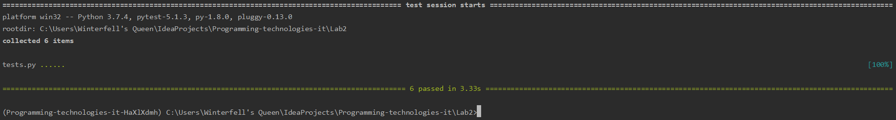

#### 1. Встановила pipenv та створила віртуальне середовище для python 3.7

#### 2. Встановила бібліотеки requests і ntplib
#### 3. Створила файл app.py і скопіювала код програми
#### 4. Програма працює правильно

#### 5. Встановила pytest і ознайомилась з документацією
#### 6. Запустила тести, вони пройшли успішно

#### 7. Написала функцію для перевірки часу AM/PM, запустила її через термінал.

#### 8. У файлі tests.py написала перевірку функції і за допомогою команди pytest запустила її. Перевірка успішна.

#### 9. Перенаправила результати програми tests.py у файл results.txt за допомогою команди ">". Додала до існуючого файлу результати програми app.py  клмандою ">>" 
#### 10. Створила makefile та заповнила його директивами для автоматизації свого проекту.