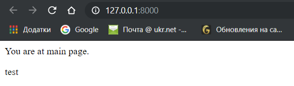
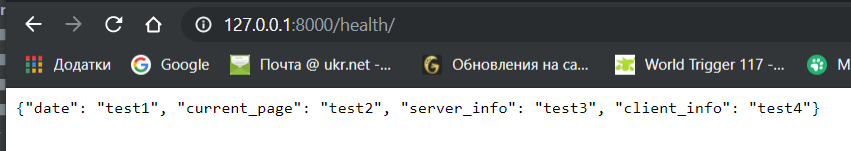

#### 1. Ініціалізувала віртуальне середовище, та встановила пакет django
#### 2. Створила заготовку проекту і винесла файли, як показано у зразку

#### 3. Запустила django server, створила фалй .gitignore і вказала що потрібно ігнорувати файл db.sqlite3

#### 4. Створила template додатку
#### 5. Створила папку templates, main.html з початковим кодом та urls.py
#### 6. Відредагувала файли settings.py and my_site/urls.py
#### 7. Поєднала функції з реальними url шляхами
#### 8. Запустила сервер

