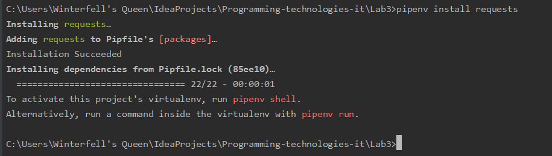

#### 1. Ініціалізувала віртуальне середовище, та встановила пакет django
#### 2. Створила заготовку проекту і винесла файли, як показано у зразку

#### 3. Запустила django server, створила фалй .gitignore і вказала що потрібно ігнорувати файл db.sqlite3

#### 4. Створила template додатку
#### 5. Створила папку templates, main.html з початковим кодом та urls.py
#### 6. Відредагувала файли settings.py and my_site/urls.py
#### 7. Поєднала функції з реальними url шляхами
#### 8. Запустила сервер

#### 9.Встановила requests

#### 10. Відкрила сторінку /health, доставила плагін JSON, щоб сторінка коректно відображалася в гугл хромі.
#### 11. Для захисту модифікувала функцію health: згенерувала на сервері дату, URL сторінки моніторингу, інформацію про сервер, на якому запущений сайт, та інформацію про клієнта, який робить запит до сервера за допомогою бібліотек.
#### Оскільки працювала на Windows, то бібліотека os не підтримувалася і замість неї використала бібліотеку platform для інформації про сервер. 
#### Дописала функціонал try except, який виводить повідомлення про недоступність сайту у випадку якщо WEB сторінка недоступна. 
#### Зробила так щоб дана програма запускалась раз в хвилину та працювала в бекграунд (за допомогою функції runminute, яка запускає main, і функції time.sleep).
#### Швидкий виклик довгих команд через monitoring = "python monitoring.py".