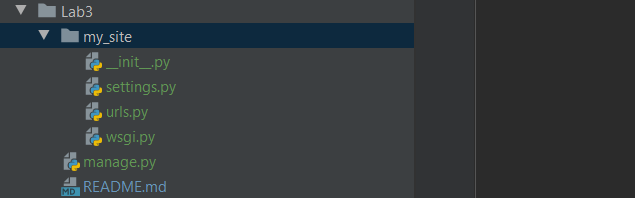
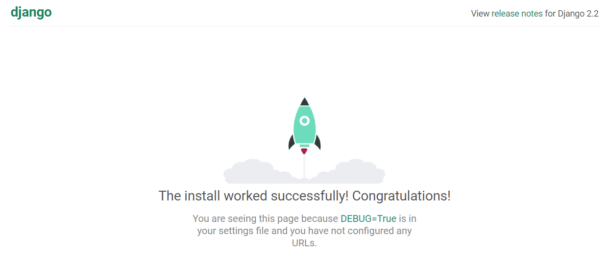

#### 1. Ініціалізувала віртуальне середовище, та встановила пакет django
#### 2. Створила заготовку проекту і винесла файли, як показано у зразку

#### 3. Запустила django server, створила фалй .gitignore і вказала що потрібно ігнорувати файл db.sqlite3
