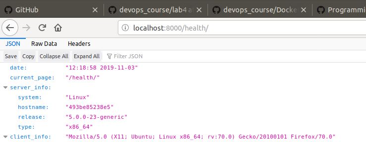

#### 1. Перевірила чи встановлений Docker. Інформація у файлі my_work.txt
#### 2. Ознайомилась з документацією. Завантажила базовий імедж python:3.7-slim. Створила Dockerfile та скопіювала вміст і відредагувала його.
#### 3. Створила власний репозиторій на Docker Hub [Посилання](https://cloud.docker.com/repository/registry-1.docker.io/katepavlenko/lab4)
#### 4. Виконала білд Docker імеджу та завантажила в репозиторій.
#### 5. Запустила сайт. Він працює ура)

#### 6. Створила ще один контейнер для програми моніторингу. Запустила обидва контейнери і витягнула файл server.log